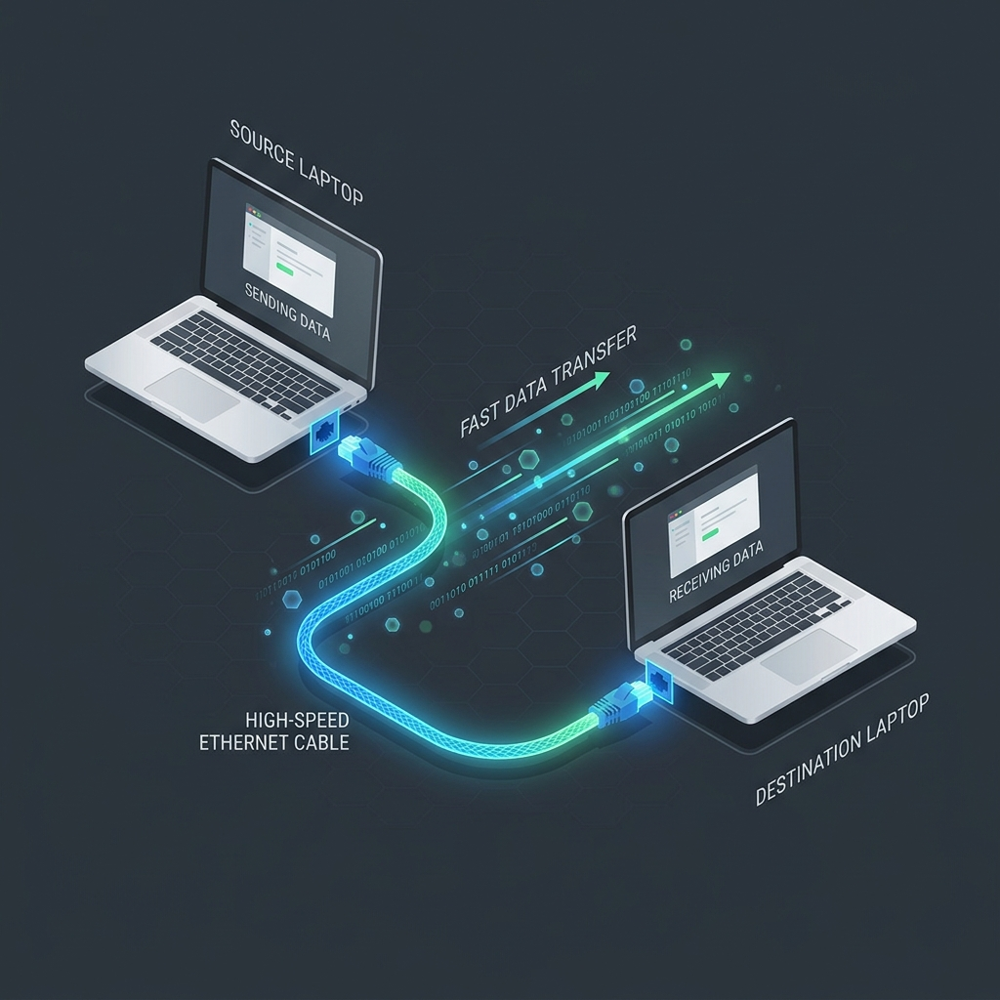

<div align="center">
  
</div>

# EtherTransfer

EtherTransfer is a lightning-fast, cross-platform file and folder transfer application designed for direct Ethernet connections between two devices. It emphasizes **maximum reliability, stability, simplicity, and enterprise-level robustness**.

<div align="center">
  
</div>

## Features

- **True Plug-and-Play**: Connect two machines via Ethernet and they automatically discover each other using UDP broadcasts (No router or DHCP required).
- **Blazing Fast**: Optimized TCP streaming maximizes Ethernet throughput (1Gbps/10Gbps/etc.).
- **Cross-Platform**: Built with .NET 10 and Avalonia UI, supporting Windows, macOS, and Linux.
- **Robust Networking**: Features dynamic port binding, link-state monitoring, and connection-drop watchdogs.
- **Deep Folder Structures**: Recursively scans and recreates entire directory trees accurately.
- **Sandbox Security**: Built-in path sanitization prevents malicious directory traversal attacks (e.g. `../../Windows/System32`).

## Quick Download

### Linux
Installs EtherTransfer effortlessly via a single command:
```bash
curl -sSL https://raw.githubusercontent.com/divyviradiya2/ethertransfer/master/install_linux.sh | sudo bash
```
*(To uninstall: run `curl -sSL https://raw.githubusercontent.com/divyviradiya2/ethertransfer/master/uninstall_linux.sh | sudo bash`)*

## Usage

1. Open the application on both computers.
2. Connect them via an Ethernet cable (or ensure they are on the same local network/VLAN).
3. The computers will appear in the peer list automatically.
4. Drag and drop files/folders onto a peer to send.
5. The receiving computer will prompt to accept the transfer and choose a save location.

---

<details>
<summary><b>Developer Guide (Architecture & Build Instructions)</b></summary>
<br>

### Architecture
EtherTransfer is structured into four main components:
1. `EtherTransfer.Core`: Shared models, configuration, and settings logic.
2. `EtherTransfer.Network`: Core UDP discovery, TCP listener logic, and low-level IP interface parsing.
3. `EtherTransfer.Transfer`: High-performance TCP streaming protocol, file scanning, and serialization.
4. `EtherTransfer.UI`: The Avalonia-based graphical user interface and view models.

### Prerequisites
- [.NET 10 SDK](https://dotnet.microsoft.com/)

### Building and Running
1. Clone the repository.
2. Open a terminal in the root directory.
3. Run the application:
   ```bash
   dotnet run --project EtherTransfer.UI
   ```
4. For a self-contained release build:
   ```bash
   dotnet publish EtherTransfer.UI -c Release -r win-x64 --self-contained true -p:PublishSingleFile=true
   ```
</details>

## License
This project is licensed under the MIT License - see the [LICENSE](LICENSE) file for details.
