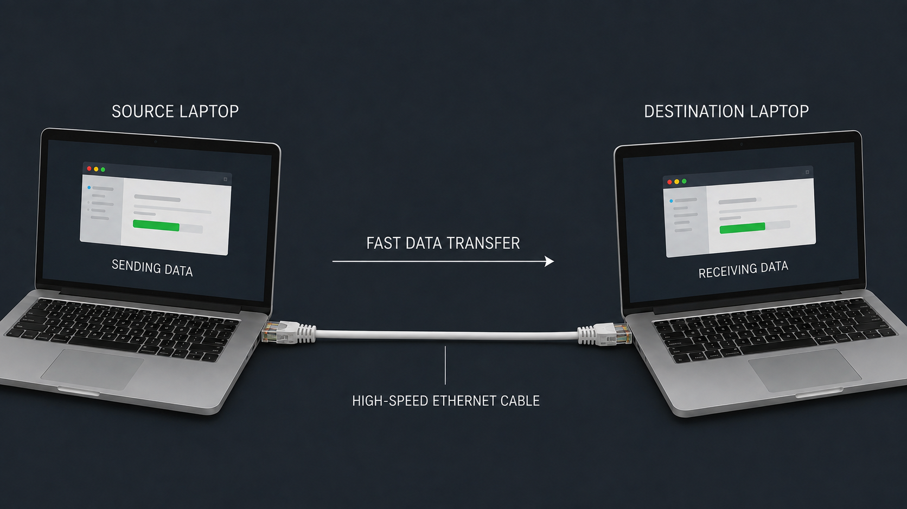

<div align="center">


# EtherTransfer

**Direct peer-to-peer file transfer over physical Ethernet links.**

Fast, zero-configuration local data movement without routers, cloud servers, or setup.

[](https://dotnet.microsoft.com/)
[](LICENSE)
[](https://divyviradiya2.github.io/ethertransfer/)
[](https://divyviradiya2.github.io/ethertransfer/docs.html)
[](https://github.com/divyviradiya2/ethertransfer/releases/latest)

<br>



</div>

<br>

## Features

- **Zero Configuration**: Connect two PCs directly with an Ethernet cable. IPv4 Link-Local addresses negotiate automatically ([RFC 3927](https://datatracker.ietf.org/doc/html/rfc3927)).
- **Instant Discovery**: Automatic peer detection across local links via UDP broadcast on Port `50000`.
- **Wire-Speed Streaming**: Framed TCP binary streaming on Port `55000` with 1 MB reusable buffer pools ([`ArrayPool<byte>`](https://learn.microsoft.com/en-us/dotnet/api/system.buffers.arraypool-1)).
- **Interface Isolation**: Saturates the physical Ethernet cable while your active Wi-Fi remains free for uninterrupted internet browsing.
- **Deep Folder Streaming**: Transmits nested directory trees on-the-fly without intermediate zip compression.
- **Cross-Platform**: Windows 10/11 & Linux supported.

---

## Documentation

Full architectural specifications, protocol framing schemas, hardware benchmarks, and developer guides are published on the **[Documentation Portal](https://divyviradiya2.github.io/ethertransfer/docs.html)**.

- [Getting Started & Supported Topologies](https://divyviradiya2.github.io/ethertransfer/docs.html#getting-started)
- [Architecture & RFC 3927 Link-Local Networking](https://divyviradiya2.github.io/ethertransfer/docs.html#architecture-networking)
- [Transfer Engine & Protocol Framing](https://divyviradiya2.github.io/ethertransfer/docs.html#transfer-engine)
- [Speed Benchmarks & Hardware Prerequisites](https://divyviradiya2.github.io/ethertransfer/docs.html#performance-benchmarks)
- [Security Model & Path Sanitization](https://divyviradiya2.github.io/ethertransfer/docs.html#security-sandboxing)
- [Developer Guide & Solution Architecture](https://divyviradiya2.github.io/ethertransfer/docs.html#developer-guide)

---

## Downloads

| Platform | Package | Download |
| :--- | :--- | :--- |
| **Windows 64-bit** | Installer (.exe) | [EtherTransfer_Setup_x64.exe](https://github.com/divyviradiya2/ethertransfer/releases/latest/download/EtherTransfer_Setup_x64.exe) |
| **Windows 32-bit** | Installer (.exe) | [EtherTransfer_Setup_x86.exe](https://github.com/divyviradiya2/ethertransfer/releases/latest/download/EtherTransfer_Setup_x86.exe) |
| **Windows 64-bit Portable** | Single-File Executable | [EtherTransfer_Portable_x64.exe](https://github.com/divyviradiya2/ethertransfer/releases/latest/download/EtherTransfer_Portable_x64.exe) |
| **Windows 32-bit Portable** | Single-File Executable | [EtherTransfer_Portable_x86.exe](https://github.com/divyviradiya2/ethertransfer/releases/latest/download/EtherTransfer_Portable_x86.exe) |
| **Linux** | Shell Script | `curl -sSL https://raw.githubusercontent.com/divyviradiya2/ethertransfer/master/install_linux.sh | sudo bash` |

---

## Development

```bash
# Clone and test
git clone https://github.com/divyviradiya2/ethertransfer.git
cd ethertransfer
dotnet test

# Run UI
dotnet run --project EtherTransfer.UI
```

---

## License

Distributed under the [MIT License](LICENSE). Developed by [Divy Viradiya](https://github.com/divyviradiya2).